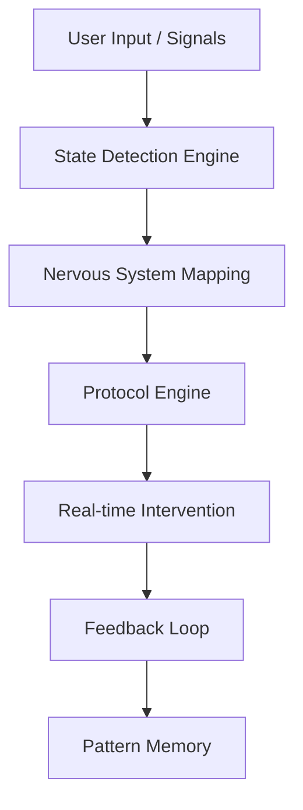

# 🧠 Nervous System Regulation Engine (NSRE)

> **Not a mental health app. Not a chatbot.**
> This is a **real-time nervous system regulation system** designed to help humans regulate their body — not just think better.

---

## 🚨 Problem

Most mental health tools today focus on:

* Thoughts (CBT, journaling)
* Reflection
* Advice

But real-world reality:

* People *understand* their problems
* Yet still feel triggered physically

👉 Because **trauma and stress are stored in the body, not just the mind**

---

## 💡 Solution

We built a system that:

* Detects **nervous system state** (fight / flight / freeze / fawn)
* Maps it to **body-level dysregulation**
* Delivers **instant physical regulation protocols**

No long conversations.
No overthinking.
Just **action**.

---

## ⚙️ How It Works



---

## 🧠 Core Features

### 1. Nervous System State Detection

* Input: text / voice / behavior
* Output:

```json
{
  "state": "freeze",
  "energy": "low"
}
```

---

### 2. Somatic Protocol Engine (🔥 Core Innovation)

Instead of advice:

```text
"Try to relax"
```

We give:

```json
[
  "press feet into ground",
  "shake arms 15 sec",
  "long exhale x5"
]
```

👉 **Body-first, not mind-first**

---

### 3. Micro-Regulation Mode (30 sec intervention)

* Step-by-step physical actions
* Minimal text
* Designed for real-time use

---

### 4. Freeze Rescue Mode 🧊

* No reading required
* One visual + guided movement
* Works when cognition is offline

---

### 5. Toxic Environment Protocol

* Designed for:

  * strict homes
  * workplaces
  * public spaces

👉 Silent, quick, invisible regulation

---

### 6. Somatic Pattern Memory

* Tracks:

  * triggers
  * states
  * what actually worked

Example:

> “You often enter freeze state after social interactions.”

---

## 🧠 AI Architecture

### 🔹 Multimodal Input Layer

* Text (primary)
* Voice tone (optional)
* Phone behavior (typing, movement)
* Camera-based heart rate (optional)

---

### 🔹 Core Intelligence

```text
Input → Emotion → Nervous State → Body → Protocol
```

Powered by:

* LLM (understanding)
* Rule-based somatic mapping
* Reinforcement Learning (future)

---

### 🔹 Personalization Layer

```text
State → Action → Feedback → Improved Action
```

👉 System learns what works **for YOU**

---

## 🔌 Tech Stack

### 🧠 AI / Backend

* Python (Flask / Django)
* LLM APIs (OpenAI / local models)
* Reinforcement Learning (future)

### 🔗 MCP Servers

* **Sequential Thinking** → core reasoning engine
* **Memory** → pattern tracking
* **Firebase** → real-time data & auth
* **Fetch** → wearable integrations (future)
* **Filesystem** → protocol storage

---

## 📱 MVP Features

* [x] Emotion → State Detection
* [x] Somatic Protocol Engine
* [x] 30-sec Intervention Flow
* [x] Basic Pattern Memory
* [ ] Voice Analysis
* [ ] Camera HR Detection
* [ ] RL Personalization

---

## 🧪 Example

**Input:**

> "I feel overwhelmed and stuck"

**Output:**

```json
{
  "state": "freeze",
  "body": ["low energy", "immobility"],
  "protocol": [
    "press feet into ground",
    "shake body 20 sec",
    "slow exhale x5"
  ]
}
```

---

## 🔬 Data Strategy

We DO NOT rely on:

* generic therapy datasets
* movie/acting data

Instead we build:
👉 **Real Nervous System Dataset**

```json
{
  "input": "...",
  "state": "freeze",
  "action": "...",
  "result": "helped"
}
```

---

## 🚀 Future Roadmap

### Phase 1 (Now)

* Core regulation engine
* Text-based detection
* Protocol system

---

### Phase 2

* Voice-based state detection
* Camera HR (PPG) integration
* Behavior signal analysis

---

### Phase 3

* Reinforcement Learning personalization
* Wearable integrations (HRV)
* Predictive intervention

---

### Phase 4 (Vision)

## → Predictive Nervous System OS

A system that:

* runs in background
* detects dysregulation before awareness
* intervenes automatically

No input required.

---

## 🌍 Impact

Designed for:

* people in toxic environments
* students under pressure
* individuals without access to therapy
* real-world stress situations

---

## 🏆 Why This Matters

Most systems:

> “Talk to you about your feelings”

This system:

> **Regulates your body in real time**

---

## 🤝 Contributing

We welcome contributions in:

* AI / ML models
* Somatic protocol design
* Signal processing
* UX for low-cognition states

---

## 📌 Vision Statement

> “We are building infrastructure for human regulation —
> a system that helps people move from survival to living.”

---

## 👩‍💻 Author

Built with a mission to solve real human problems beyond surface-level solutions.

---

## ⭐ If you believe in this idea, star the repo

---
